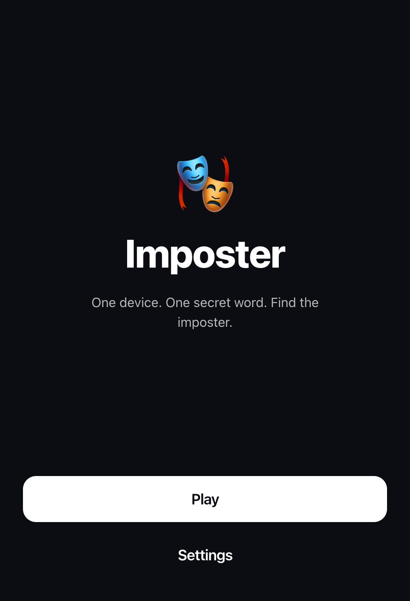

# Imposter

A single-device "find the imposter" party game. Pass the phone around: everyone holds to reveal their secret word, except one player who sees `IMPOSTER` and has to bluff. After the round timer, vote anonymously and unmask them.

Runs entirely in the browser, installable as a PWA, fully offline once loaded.

<p align="center">
  
</p>

## Stack

React 19 · TypeScript · Vite · Tailwind · vite-plugin-pwa. No backend, no tracking, no accounts.

## Run it locally

```bash
npm install
npm run dev
```

Production build + offline preview:

```bash
npm run build
npm run preview
```

## Contributing words

Word lists live as JSON in [`src/locales/<locale>/words/`](src/locales). To add or edit content, no code changes are needed — just edit the JSON.

To add a new language, drop a folder next to `nl-BE/` and `en/` mirroring its structure, then add the locale code to `AVAILABLE_LOCALES` in [`src/i18n/locales.ts`](src/i18n/locales.ts).

## Licence

MIT.
